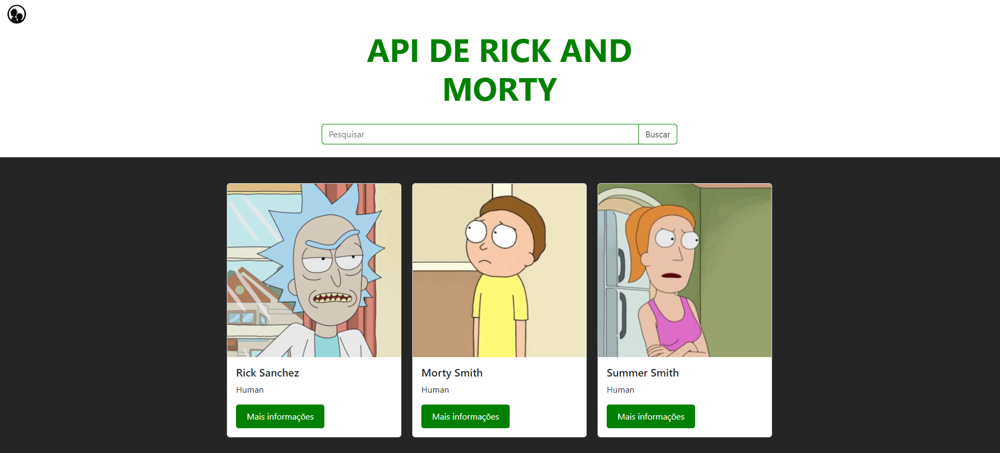

# API de rick and morty

[Link para visualização:](https://rick-and-morty-eight-orpin.vercel.app)

## Descrição do projeto

A aplicação foi desenvolvida como atividade para o curso de desenvolvimento Web Full Stack da [Growdev](https://www.growdev.com.br/), contendo classes do bootstrap, responsividade e animações utilizando keyframes, o intuito da aplicação é fazer uma listagem de personagens da serie rick and morty, consumindo a [api](https://rickandmortyapi.com) publica da mesma, a aplicação foi desenvolvida utilizando html, css e javascript.
